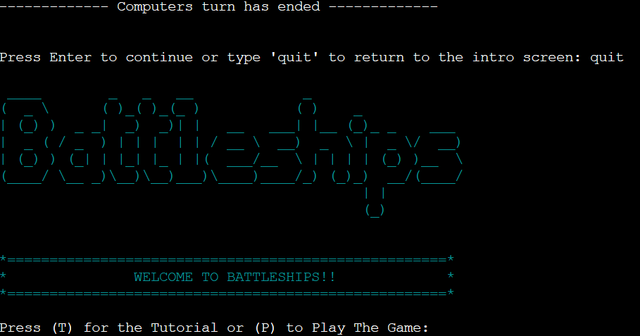

# Battleships

I have built this game to mimic the old classic game 'Battleships'. the game has been designed to allow the player to interact though the termianl and play against the computer. The game generates a 6x6 playing board for the player and cpmputer and randomizes the ship positions each game. The player will then guess a row and column each round which is followed by the computers guess. The game continues until either the player or computer sinks the opponents ships. The Player also has the option to quit the game after each turn. 

The game has been created for my third Code Institute portfolio project and is a Python based program. The Battleships site is live and can be found by clicking [here](https://battleships-cd-aee01aae76c3.herokuapp.com/)

## **Table Of Contents**

- [Table Of Contents](#table-of-contents)
    - [User Experience](#user-experience-ux)
        - [Site Purpose](#site-purpose)
        - [Target Audience](#target-audience)
        - [User Goals](#user-goals)
        - [Future Implementations](#future-implementations)
    - [Design](#design)
        - [Structure](#structure)
    - [Site Features](#site-features)
        - [Introduction](#introduction)
        - [Tutorial](#tutorial)
        - [Play Game](#play-game)
        - [Game Boards](#game-baords)
        - [Player Guess](#player-guess)
        - [Computer Guess](#computer-guess)
        - [Game Statistics](#game-statistics)
        - [Input Validation](#input-validation)
        - [Play Again](#play-again)
        - [Quit Game](#quit-game)
    - [Technologies Used](#technologies-used)
        - [Languages](#languages)
        - [Frameworks and tools](#Frameworks-and-tools)
    - [Testing and Validation](#testing-and-validation)
        - [Code Institute Python Linter](#code-institute-python-linter)
        - [Feature Testing](#feature-testing)
    - [Bugs](#bugs)
        - [Resolved Bugs](#resolved-bugs)
    - [Deployment](#deployment)
    - [Local Deployment](#local-deployment)
        - [Fork](#fork)
        - [Clone](#clone)
    - [Credits](#credits)
        - [Code](#code)
        - [Acknowledgements](#acknowledgements)

## **User Experience UX**

### **Site Purpose**

This game has been built for my third portfolio project with the Code Institute. The purpose of the site is let users play the old classic game Battleships against a randomised computer output.

### **Target Audience**

The target audience for this site is for fans of the Battleship game and anybody else who just wants have a bit of fun to pass some time.

### **User Goals**

As A user playing the game:

- I want to play and enjoy the classic Battleships game.
- I want to have a tutorial on how the game works.
- I want to be able to see my hits and missies on a board.
- I want to be able to keep record of thw wins and losses.
- I would like to choose how many ships I can place on the board.
- I want a fair game against the computer.

### **Future Implementations**

My future plans for the game are to allow the user to choose their board size and place their own ships.

## **Design**

### **Structure**

The Flowchart drafts out how the program will work and shows the logic of the flow of the game.

Flowchart

## **Site Features**

### **Introduction**

When the program is first run, the game starts with by displaying a Battleships logo using ASCII art, a welcome message and the option to view a tutorial or play the game.

Intro Screen

### **Tutorial**

If the user selects to view the tutorial, the program will display a welcome to Battleships message and also instructions on how play the game.

Tutorial Screen

### **Play Game**

To play the game, the user will be asked to enter their name, which will personalise the game board, and also to enter the number of ships they would like to play with, with a minumum of 2 and a maximum of 10. The ships will randomise their positions for each new game.

Play Game

### **Game Boards**

Once the user has entered their name and the amount of ships they would like to play with, the game will then start, displaying the players and computers boards with a 6x6 grid. The players board will display their ship positions marked as an 'S' and the computers ships are hidden.

New Game Boards

As the game goes on and the player and computer are taking guesses, each guess will marked on the board as either a hit or miss. A hit will be mraked as a red * and misses will be marked with a green X.

In Game Boards

### **Player Guess**

For the player to take a guess, they will be first asked to guess a column, which will be from the letters a-f followed by a prompt to guess a row from numbers 1-6. After the player has made their guesses, they will be told immediately if they hit or miss the computers ship and a print statement will display stating the end of the players turn.

Player Guess

### **Computer Guess**

Once the players turn has ended, the computer will automatically make its guess. The user will see a statement displaying 'computer is thinking' which will show for 2 seconds followed by a message whether the computer hit or missed and at which co-ordinates. Another statement will then follow stating the computers turn has ended.

Computer Guess

### **Game Statistics**

Once either the player or the computer has sank all of the opponents ships, the program will then display some statistics and a statement telling the player if they won or lost signalling the end of the game. The statsitics increment each time a game and show the below stats - 

* Games Played
* Wins
* Losses
* Total Shots Taken
* Hits
* Misses
* Hit/Miss Ratio

Game Statistics

 

Plyer Win Message

 

Player Lost Message

### **Input Validation**

The game handles invalid player inputs throughout the game, starting from the intro screen. If the user enters anything other than 't''T' or 'p''P' then an invalid input error will appear in red stating what they need to press.

Invalid Introduction Input

When the user is asked to enter their name to start, if nothing is entered, the player will see a prompt stating that no name was entered and they needto enter a name to continue.

No Name Entered

When the user is asked to enter the number of ships they would like to place on the board, there are 2 errors in place to handle not selecting a number between '2' and '10' and also if they entered a word and not a number.

Invalid Ship Input

Validation input errors have been set up to handle the players column and row guesses. If the user doesnt enter a letter between 'a' and 'f'  when asked to guess a column, an invalid input error will appear in red stating their input isnt valid.

Invalid Column Input

If the user enters a word instead of a number for their row guess, they will receive an error telling them to enter a single digit between '1' and '6' and if they enter a number outside the boundries of the board, they will reveive an error prompting them to enter a row between '1' and '6'.

Invalid Row Input

If the user tries to guess a mark, which has already been guessed before, a prompt willappear telling the user that they have already guessed that spot. They will then be required to take abother guess.

Aleady Guessed Co-ordinate

### **Play Again**

At the end of a game, once all the oponents ships have been sunk, the user will be asked if they would like to play again. The user will need to input 'yes' or 'no' at this point. If the user enters 'yes', they will then be asked to slect how many ships to play with again and then the game will start again with fresh boards and ships in random places again. If the user enters 'no' this display a thank you for playing and will terminate the game. If the user enters anything other than 'yes' or 'no', they will see an invalid input statement.

Play Again? Yes

 

Play Again? No

Play Again? Invalid Input

'Exit' to Quit

Quit Game

Python Linter

</details

### **Feature Testing**

