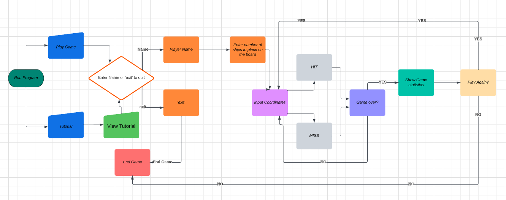

# Battleships

I have built this game to mimic the old classic game 'Battleships'. the game has been designed to allow the player to interact though the termianl and play against the computer. The game generates a 6x6 playing board for the player and cpmputer and randomizes the ship positions each game. The player will then guess a row and column each round which is followed by the computers guess. The game continues until either the player or computer sinks the opponents ships. The Player also has the option to quit the game after each turn. 

The game has been created for my third Code Institute portfolio project and is a Python based program. The Battleships site is live and can be found by clicking [here](https://battleships-cd-aee01aae76c3.herokuapp.com/)

## **Table Of Contents**

- [Table Of Contents](#table-of-contents)
    - [User Experience](#user-experience-ux)
        - [Site Purpose](#site-purpose)
        - [Target Audience](#target-audience)
        - [User Goals](#user-goals)
        - [Future Implementations](#future-implementations)
    - [Design](#design)
        - [Structure](#structure)
    - [Site Features](#site-features)
        - [Introduction](#introduction)
        - [Game Start](#game-start)
        - [Game Boards](#game-baords)
        - [Player Guess](#player-guess)
        - [Computer Guess](#computer-guess)
        - [Game-Statistics](#game-statistics)
        - [Play Again](#play-again)
        - [Quit Game](#quit-game)
    - [Technologies Used](#technologies-used)
        - [Languages](#languages)
        - [Frameworks and tools](#Frameworks-and-tools)
    - [Testing and Validation](#testing-and-validation)
        - [Code Institute Python Linter](#code-institute-python-linter)
        - [Feature Testing](#feature-testing)
    - [Bugs](#bugs)
        - [Resolved Bugs](#resolved-bugs)
    - [Deployment](#deployment)
    - [Local Deployment](#local-deployment)
        - [Fork](#fork)
        - [Clone](#clone)
    - [Credits](#credits)
        - [Code](#code)
        - [Acknowledgements](#acknowledgements)

## **User Experience UX**

### **Site Purpose**

This game has been built for my third portfolio project with the Code Institute. The purpose of the site is let users play the old classic game Battleships against a randomised computer output.

### **Target Audience**

The target audience for this site is for fans of the Battleship game and anybody else who just wants have a bit of fun to pass some time.

### **User Goals**

As A user playing the game:

- I want to play and enjoy the classic Battleships game.
- I want to have a tutorial on how the game works.
- I want to be able to see my hits and missies on a board.
- I want to be able to keep record of thw wins and losses.
- I would like to choose how many ships I can place on the board.
- I want a fair game against the computer.

### **Future Implementations**

My future plans for the game are to allow the user to choose their board size and place their own ships.

## **Design**

### **Structure**

The Flowchart drafts out how the program will work and shows the logic of the flow of the game.

Flowchart

