# Battleships

I have built this game to mimic the old classic game 'Battleships'. the game has been designed to allow the player to interact though the termianl and play against the computer. The game generates a 6x6 playing board for the player and cpmputer and randomizes the ship positions each game. The player will then guess a row and column each round which is followed by the computers guess. The game continues until either the player or computer sinks the opponents ships. The Player also has the option to quit the game after each turn. The end of the each game will display a statistics board which increments over multiple games.

The game has been created for my third Code Institute portfolio project and is a Python based program. The Battleships site is live and can be found by clicking [here](https://battleships-cd-aee01aae76c3.herokuapp.com/)

## **Table Of Contents**

- [Table Of Contents](#table-of-contents)
    - [User Experience](#user-experience-ux)
        - [Site Purpose](#site-purpose)
        - [Target Audience](#target-audience)
        - [User Goals](#user-goals)
        - [Future Implementations](#future-implementations)
    - [Design](#design)
        - [Structure](#structure)
    - [Site Features](#site-features)
        - [Introduction](#introduction)
        - [Tutorial](#tutorial)
        - [Play Game](#play-game)
        - [Game Boards](#game-baords)
        - [Player Guess](#player-guess)
        - [Computer Guess](#computer-guess)
        - [Game Statistics](#game-statistics)
        - [Input Validation](#input-validation)
        - [Play Again](#play-again)
        - [Quit Game](#quit-game)
    - [Technologies Used](#technologies-used)
        - [Languages](#languages)
        - [Frameworks and tools](#Frameworks-and-tools)
    - [Testing and Validation](#testing-and-validation)
        - [Code Institute Python Linter](#code-institute-python-linter)
        - [Feature Testing](#feature-testing)
    - [Bugs](#bugs)
        - [Resolved Bugs](#resolved-bugs)
    - [Deployment](#deployment)
    - [Local Deployment](#local-deployment)
        - [Fork](#fork)
        - [Clone](#clone)
    - [Credits](#credits)
        - [Code](#code)
        - [Acknowledgements](#acknowledgements)

## **User Experience UX**

### **Site Purpose**

This game has been built for my third portfolio project with the Code Institute. The purpose of the site is let users play the old classic game Battleships against a randomised computer output.

### **Target Audience**

The target audience for this site is for fans of the Battleship game and anybody else who just wants have a bit of fun to pass some time.

### **User Goals**

As A user playing the game:

- I want to play and enjoy the classic Battleships game.
- I want to have a tutorial on how the game works.
- I want to be able to see my hits and missies on a board.
- I want to be able to keep record of thw wins and losses.
- I would like to choose how many ships I can place on the board.
- I want a fair game against the computer.

### **Future Implementations**

My future plans for the game are to allow the user to choose their board size and place their own ships.

## **Design**

### **Structure**

The Flowchart drafts out how the program will work and shows the logic of the flow of the game.

Flowchart

## **Site Features**

### **Introduction**

When the program is first run, the game starts with by displaying a Battleships logo using ASCII art, a welcome message and the option to view a tutorial or play the game.

Intro Screen

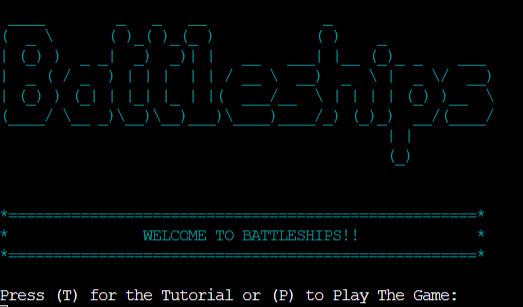

### **Tutorial**

If the user selects to view the tutorial, the program will display a welcome to Battleships message and also instructions on how play the game.

Tutorial Screen

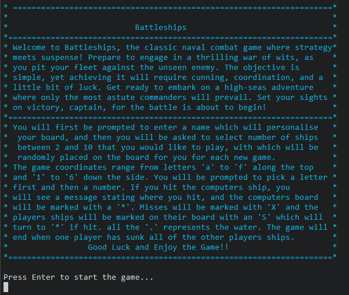

### **Play Game**

To play the game, the user will be asked to enter their name, which will personalise the game board, and also to enter the number of ships they would like to play with, with a minumum of 2 and a maximum of 10. The ships will randomise their positions for each new game.

Play Game

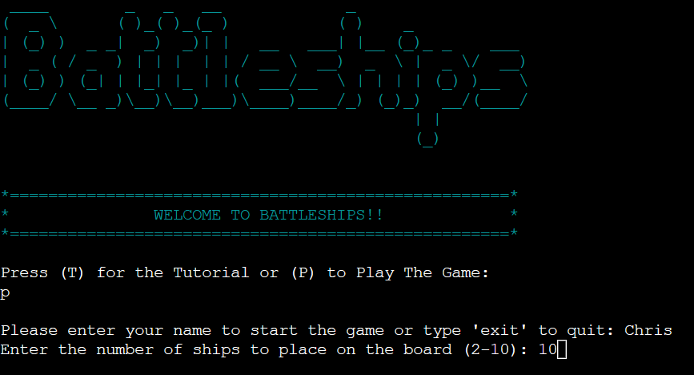

### **Game Boards**

Once the user has entered their name and the amount of ships they would like to play with, the game will then start, displaying the players and computers boards with a 6x6 grid. The players board will display their ship positions marked as an 'S' and the computers ships are hidden.

New Game Boards

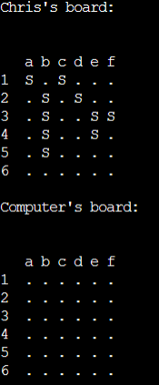

As the game goes on and the player and computer are taking guesses, each guess will marked on the board as either a hit or miss. A hit will be mraked as a red '*' and misses will be marked with a green 'X'.

In Game Boards

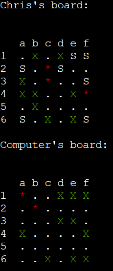

### **Player Guess**

For the player to take a guess, they will be first asked to guess a column, which will be from the letters 'a-f' followed by a prompt to guess a row from numbers '1-6'. After the player has made their guesses, they will be told immediately if they hit or miss the computers ship and a print statement will display stating the end of the players turn.

Player Guess

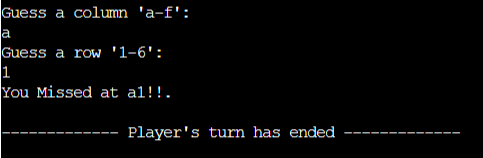

### **Computer Guess**

Once the players turn has ended, the computer will automatically make its guess. The user will see a statement displaying 'computer is thinking' which will show for 2 seconds followed by a message whether the computer hit or missed and at which co-ordinates. Another statement will then follow stating the computers turn has ended.

Computer Guess

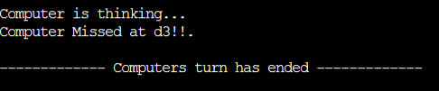

### **Game Statistics**

Once either the player or the computer has sank all of the opponents ships, the program will then display some statistics and a statement telling the player if they won or lost signalling the end of the game. The statsitics increment each time a game and show the below stats - 

* Games Played
* Wins
* Losses
* Total Shots Taken
* Hits
* Misses
* Hit/Miss Ratio

Game Statistics

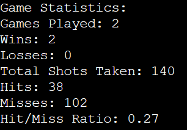

 

Plyer Win Message

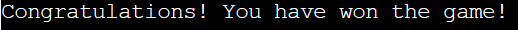

 

Player Lost Message

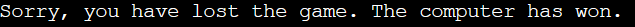

### **Input Validation**

The game handles invalid player inputs throughout the game, starting from the intro screen. If the user enters anything other than 't''T' or 'p''P' then an invalid input error will appear in red stating what they need to press.

Invalid Introduction Input

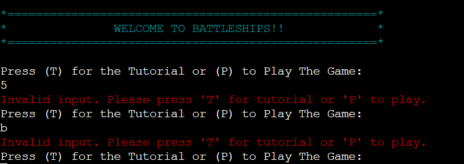

When the user is asked to enter their name to start, if nothing is entered, the player will see a prompt stating that no name was entered and they need to enter a name to continue.

No Name Entered

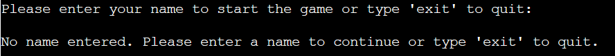

When the user is asked to enter the number of ships they would like to place on the board, there are 2 errors in place to handle not selecting a number between '2' and '10' and also if they entered a word and not a number.

Invalid Ship Input

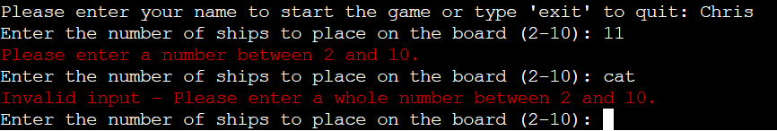

Validation input errors have been set up to handle the players column and row guesses. If the user doesnt enter a letter between 'a' and 'f'  when asked to guess a column, an invalid input error will appear in red stating their input isnt valid.

Invalid Column Input

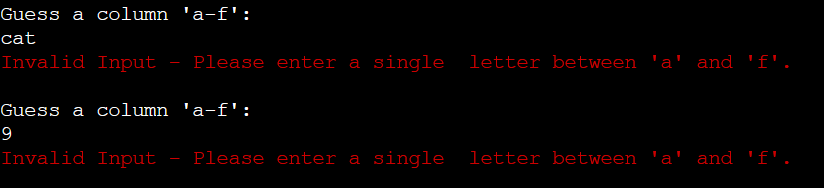

If the user enters a word instead of a number for their row guess, they will receive an error telling them to enter a single digit between '1' and '6' and if they enter a number outside the boundries of the board, they will reveive an error prompting them to enter a row between '1' and '6'.

Invalid Row Input

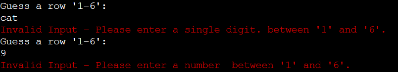

If the user tries to guess a mark, which has already been guessed before, a prompt will appear telling the user that they have already guessed that spot. They will then be required to take abother guess.

Aleady Guessed Co-ordinate

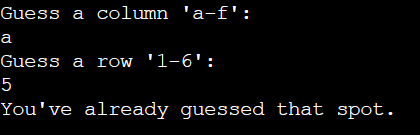

### **Play Again**

At the end of a game, once all the oponents ships have been sunk, the user will be asked if they would like to play again. The user will need to input 'yes' or 'no' at this point. If the user enters 'yes', they will then be asked to slect how many ships to play with again and then the game will start again with fresh boards and ships in random places again. If the user enters 'no' this display a thank you for playing and will terminate the game. If the user enters anything other than 'yes' or 'no', they will see an invalid input statement.

Play Again? Yes

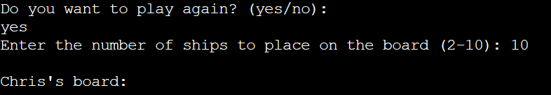

 

Play Again? No

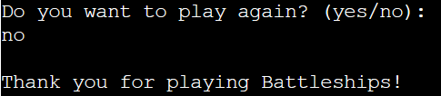

Play Again? Invalid Input

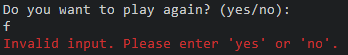

'Exit' to Quit

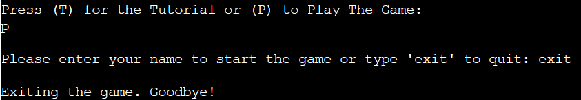

Continue or Quit

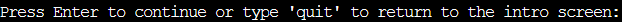

Python Linter

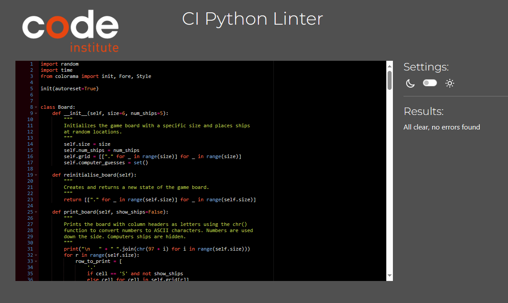
</details

### **Feature Testing**

| Test                     | Expected               | Result
| ---| ---| ---|
| Type "python3 run.py into the terminal | The page should load in the terminal with no errors. | Pass |
| Press 'T' to view the tutorial or 'P' to play the game. | Pressing 'T' displays the tutorial and 'P' starts the game. Anything other than 'T' or 'P' displays an invalid input error message.| Pass|
| Enter name to start the game. | The user will then be asked to enter how many ships they would like to play with. | Pass |
| Type 'exit' on the enter name or exit to quit prompt. |The game exits with a goodbye message to the player. | Pass |
| Enter nothing on the on the enter name or exit to quit prompt. | A prompt appears telling the user no name was entered. | Pass |
| Enter number of ships on the board from 2-10. The users enters a number outside of this range - 22. | Message appears telling the user enter a number between 2 and 10. | Pass |
| Enter number of ships on the board from 2-10. The users enters a word - cat. | Invalid Input error message appears stating to enter a whole number between 2 and 10. | Pass |
| Enter a valid name and number of ships to play with. | The game loads displaying the players board with the ships randomly placed marked as 'S' and the computers board with ships hidden. | Pass |
| User is asked to guess a column 'a' - 'f'. User enters 'e' | The player will then be asked to guess a row. | Pass |
| User is asked to guess a column 'a' - 'f'. User enters 'z'. | Invalid Input error appears. | Pass |
| User is asked to guess a column 'a' - 'f'. User enters a number - 5. | Invalid Input error appears. | Pass |
| User is asked to guess a row from numbers '1'-'6'. User enters '2'. | Screen shows whether the player hit or missed and the co-ordinates entered and then automatically the computer will take its turn and display whether it hit or missed. | Pass |
| User is asked to guess a row from numbers '1'-'6'. User enters '9'. | Invalid input message appears. | Pass |
User is asked to guess a row from numbers '1'-'6'. User enters a word - dog. | Invalid input message appears. | Pass |
| Both players make valid guesses. | After the player and computer have taken a turn, the player will be asked to press enter to continue or type quit to return to the intro screen. | Pass |
| Press enter to continue. | The screen then displays both the player and computers boards with the updated marks and asks for guesses again. | Pass |
| User types 'quit' to return to the intro screen. | game returns to the intro screen. | Pass |
| User guesses the same spot twice. | message appears telling the user they have already guessed that spot. | Pass |
| End of a game when all of a players have been sunk. | A message appears telling the player if they have won or lost. | Pass |
| End of a game when all of a players have been sunk. | Displays the game statisctics which increments over each new game. | Pass |
End of a game when all of a players have been sunk. | A message is displayed asking if the user wants to play again. | Pass |
| User enters 'yes' to play again. | The user will then be asked to enter the ships to play with and then a new game will start with fresh boards and ships randomized again. | pass |
| User enters anything other than 'yes' or 'no' on the play again prompt. e.g 99, cat. | Invalid input message appears. | Pass |
User enters 'no' to play again. | The game ends with a message stating thanks for playing. | Pass |

## **Bugs**

### **Resolved Bugs**

| Problem                    | Fix            
| ---| ---|
| If the player input the same coordinates twice, the game wouldnt let them take another guess and would just carry on the computers turn. | Added 'while True loops to the player and computers turns. This is to enure that both players can only proceed after making a valid guess. |
| If the user accidentally pressed 2 or more keys simultaneously, it caused the game to error and stop completely. | Update the input validation to check for a single character input for columns and ensure that the input for rows is a single digit that falls within the valid range. |
| When the computers turn had ended, the intented print statement was not printing to the terminal. | The print statement was outside of the 'while True' loop in the run_game funcion. Corrected the indentation. | 
| While writing the readme and playing the game for final testing, I noticed if the user accidentally pressed a key the game would just end as the code was set to 'if play_again != "yes":' so anything other than 'yes' input would end the game. | I added a new loop in the run_game function which will only accept'yes' or 'no' inputs from the player. If anything else is input then an invalid input error will be displayed. |

## **Deployment**

For this project, Heroku was was used to deploy this site due to this being a backend programme. The Code Institute template used for this project allows the programme to be run in a mock terminal through a web browser.

The following steps were taken to deploy the site using Heroku:

* Create a Heroku account.
* Click the 'create new app' button on heroku.
* Create a name for your app. This needs to be unique.
* Select the region you are based.
* Select 'create app'.
* Click on the 'settings' tab.
* The following setting are used:
  * Config vars: KEY = PORT, VALUE = 8000.
* Select 'add buildpack'.
 * The following build packs are used (in this order with Python on top):
   * Python
    * Node JS
* Select the 'deploy tab'.
* Select the deployment method (github was used for this project).
* Search for your repository name.
* Click 'connect'.
* Choose whether to use manual deployment or automatic deployment and make sure that 'main branch' is selected.
* If the deployment is successful, you will see a message saying 'your app was successfully deployed'. You will then see a 'view' button which if you click to take you to your deployed application.

### **Local Development**

### **Fork**

To Fork the repository, please follow the below steps - 

1. Login to GitHub.
2. Select the repository for the project you wish to fork.
3. Click the fork botton in the top right-hand corner.

### **Clone**

To clone the repository, please follow thw below steps - 

1. Login to GitHub.
2. Select the repository for the project you wish to clone.
3. Click on the code button and choose whether you would like to clone with HTTPS, SSH or GitHub CLI and copy the link shown.
4. Open a new terminal in the IDE used and change the current working directory to the location you want to use for the cloned directory.
5. Type 'git clone' into the terminal and then paste the link you copied in step 3 then press enter.

## **Credits**

### **Code**

The inspiration for the game was taken from the scope video on the Code Institute LMS.

The use of the chr() and ord() functions to convert Integer to a Character and Character to an Integer was used using the below website:
- https://www.askpython.com/python/built-in-methods/python-chr-and-ord-methods

The below youtube videos were watched for ideas on how to code the game but the content of the game was written by myself:
- https://www.youtube.com/watch?v=tF1WRCrd_HQ
- https://www.youtube.com/watch?v=u3yo-TjeIDg

### **Acknowledgements**

I would like to thank the below during my time doing this project -

- My Wife and Kids for their always continued support and repeatedly playing the game to see if they can find anything wrong.

- The Slack community for when you need help, a laugh or to help somebody else out.

- Stackoverflow and W3Schools for hints and tips with code issues.

- Code Institute Love Sandwiches project which prepared me for this project.

- Using my codewithmosh subscription and going through the Complete Python Mastery course, and my Python Programming by Kit jackson book for extra learning on Python.